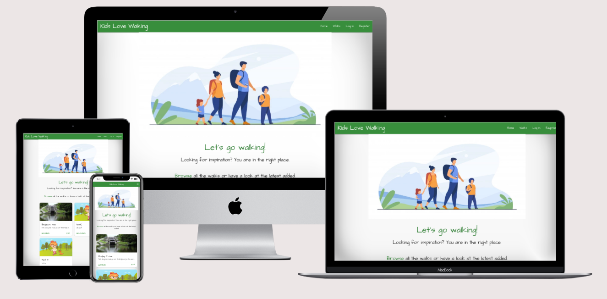

# Kids Love Walking

*An app where users can explore and share their own favourite walks.*

**[Live demo](https://kids-love-walking.onrender.com/home)**

---
[**Index**](#up)  
[**1. Overview**](#1-overview)  
[**2. UX**](#2-ux)  
- [2.1 User Stories](#21-user-stories)  
- [2.2 Wireframes](#22-design) 
- [2.3 Design](#23-design) 

[**3. Features**](#3-features) 
- [3.1 Existing features](#31-existing-features)  
- [3.2 Features to add](#32-features-to-add)  

[**4. Technologies used**](#4-technologies-used)  
[**5. Testing**](#5-testing)  
[**6. Deployment**](#6-deployment)  
[**7. Credits**](#7-credits)  


# 1. Overview   
The aim of this application is to offer parents a source of inspiration and help them choose an appropriate walk for the whole family, considering the little feet especially. Furthermore, the app is encouraging parents to share their own favourite walks so that others could enjoy them too.
# 2. UX  
From a user's point of view the application should be intuitive and easy to use whilst presenting the information in a manner that would make the visitor come back in the future.  
## 2.1 User Stories  
**First time visitor**  
&rarr; User is able to find relevant information about walks  
&rarr; User can filter information using a search field  
&rarr; User can register easily    
**Returning visitor**  
&rarr; User can see last added walks  
&rarr; User can log in/log-out  
&rarr; User can add their favourite walks  
&rarr; User can see their contribution in Profile section  
&rarr; User can edit/delete their contribution  
**Site owner**  
&rarr; Admin can add/remove categories  

## 2.2 Wireframes
Wireframes were created for every page, considering mobile, tablet and desktop views. Full size wireframes can be checked **[here](wireframes)**.
## 2.3 Design
The project uses Materialize framework and it's grid system that allows the project to be responsive across different devices.  
### Colour scheme
For simplicity the project uses Materialize's colour scheme, the following being chosen:
-  #388e3c (green darken-2)
-  #e8f5e9 (green lighten-5)
-  #ff8f00 (amber darken-3)  


 For Header, Footer and call to action buttons the colour being used is green darken-2, to represent the green found on walks most of the year. Also green lighten-5, a pale shade of green, is used as background for flashed messages and cards.   
For Cancel/Delete buttons the colour chosen was amber darken-3, the colour of leaves in autumn, to represent a warning about the action to be made.

### Font
The font used is trying to suggest that the walks have a personal touch, being hand-written by the user, hence the cursive Google font *Architects Daughter* was chosen.
## 3. Features
### 3.1 Existing features  
The app makes use of the following features:
### **Material design and its features:**
- Cards
- Forms
- Modal
- Sidenav
### **Register and Login**
- Werkzeug security was used to store user's hashed password.
### **CRUD functionality**
New visitors have access to the *walks* collection whilst registered users can:
- Add new walk
- Edit their own additions
- Delete their own additions.
The admin can also add/edit/delete categories in the collection.  
### **User profile**
Registered users get access to their own walks in the *Profile* page, making editing/deleting process easier.
### **Defensing Programming**
To prevent accidental deletion of walks, users are asked to confirm again before deleting, through a modal pop-up.
### 3.2 Features to add
- Comments for individual walks
- Option to add user profile picture
- Option to save favourite walks
## 4. Technologies used
### Languages
- [HTML](https://developer.mozilla.org/en-US/docs/Web/HTML)
- [CSS](https://developer.mozilla.org/en-US/docs/Web/CSS)
- [Javascript](https://developer.mozilla.org/en-US/docs/Web/JavaScript)
- [Python](https://www.python.org/)
  - [Jinja](https://jinja.palletsprojects.com/en/2.11.x/)
### Frameworks
- [Flask](https://palletsprojects.com/p/flask/)
- [jQuery](https://jquery.com/)
- [Materialize](https://materializecss.com/)
### Project management
- [Lucid](https://lucid.co/)
- [GitHub](https://github.com/)
- [GitPod](https://gitpod.io/)
- [Heroku](https://www.heroku.com/about)
- [MongoDB](https://www.mongodb.com/)

## 5. Testing
Testing details can be found [here](testing.md).
## 6. Deployment
### **Cloning Kids Love Walking**
The project used the [Code Institute's template](https://github.com/Code-Institute-Org/gitpod-full-template) to create a GitHub repository and then all other code was created in [Gitpod](https://www.gitpod.io/) and pushed into GitHub using the Terminal and the following commands:  
- ```git add```, to stage files to be commited;
- ```git push```, to upload content. 

To clone this project, go to its [repository](https://github.com/StefanMdvs/kids-love-walking):
1. Click on the "Code" button and select how to clone it: using HTTPS, SSH or GitHub CLI;
2. Click on the copy icon to the right
3. From a terminal window, change to the local directory where you want to clone your repository
4. Use ```git clone``` and paste in the command you copied before
5. Press Enter and a local clone will be created
6. Create env.py file that will hold your app's environment variables, which should contain the following:
```
import os

os.environ.setdefault("IP", "0.0.0.0")
os.environ.setdefault("PORT", "5000")
os.environ.setdefault("SECRET_KEY", "your_app__secret_key")
os.environ.setdefault("MONGO_URI", "mongodb+srv://<username>:<password>@<cluster_name>.uhrbq.mongodb.net/<db_name>?retryWrites=true&w=majority")
os.environ.setdefault("MONGO_DBNAME", "<db_name>")
```
7. Before the first commit check that your ```env.py``` is listed in .gitignore file to prevent any sensitive information being pushed publicly.
8. Run the app locally by using: ```python3 app.py```.

### **Deploying to Heroku**
The app was deployed to Heroku from its GitHub repository using the following steps:  
1. Create *requirements.txt* and *Procfile*:  
```pip3 freeze --local > requirements.txt```   
```echo web: python app.py > Procfile```   
*If other dependencies are added to the project at a later development stage, it is important to update the **requirements.txt** file, using the same command stated above.* 

2. Push these files to GitHub  
3. Log In to Heroku  
4. Select Create new app from the dropdown in the Heroku dashboard  
5. Choose a name that must be unique and the location closest to you  
6. Go to the Deploy tab and under Deployment method choose GitHub  
7. In Connect to GitHub enter your GitHub repository details and once found, click Connect
8. Go to the Settings tab and under Config Vars choose Reveal Config Vars
9. Enter the following keys and values, which must match those in the env.py file created earlier:  

| Key          | Value                                                                                                        |
|--------------|--------------------------------------------------------------------------------------------------------------|
| IP           | 0.0.0.0                                                                                                      |
| PORT         | 5000                                                                                                         |
| SECRET_KEY   | <your_app_secret_key                                                                                         |
| MONGO_URI    | mongodb+srv:// <username> :@ <cluster_name> -ofgqg.mongodb.net/ <database_name> ?retryWrites=true&w=majority |
| MONGO_DBNAME | <db_name>                                                                                                    |
  
10. Go to Deploy tab and under Automatic deploys choose Enable Automatic Deploys
11. Under Manual deploy, select master and click Deploy Branch
12. After the app has finished building, click Open app from the header row of the dashboard.

# 7. Credits
**Tutorials**
  - Code Institute Task Manager Project

**Student Projects**
  - [Self Isolution](https://github.com/Edb83/self-isolution)

**Media**
  - Home Page image is from [Freepik](https://www.freepik.com/free-vector/happy-active-family-walking-outdoors_7732632.htm).
  - Default image for walks is from [Dreamstime](https://www.dreamstime.com/child-walking-nature-vector-kid-spending-time-pet-owner-canine-friendship-human-animal-holidays-summer-image151715809).
  - Favicon image is from [Freepik](https://www.freepik.com).
  
  **Acknowledgements**  
  - My mentor, Spencer Barriball for his knowkedge and availability
  - Code Institute Tutor Ed for his input with my update bug
  - Fellow student Dan Otter for his eagle eye and spotting the error in my edit_walk page.
  
